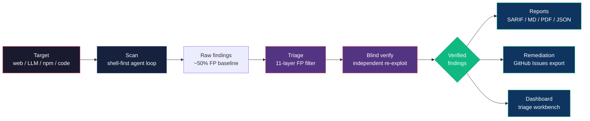
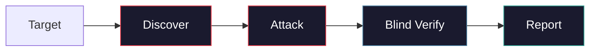
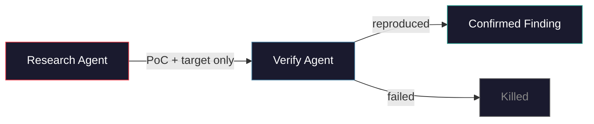
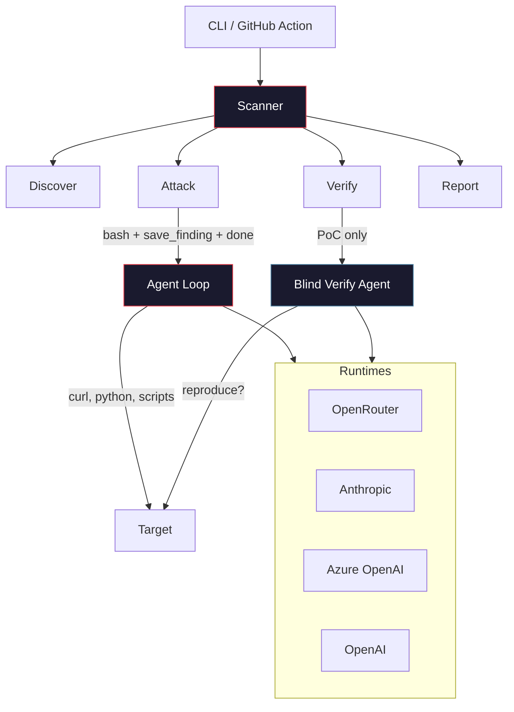

<p align="center">
 
</p>

<h1 align="center">pwnkit</h1>

<p align="center">
 <strong>Let autonomous AI agents hack you so the real ones can't.</strong><br/>
 <em>Fully autonomous agentic pentesting framework.</em>
</p>

<p align="center">
 <a href="https://www.npmjs.com/package/pwnkit-cli"></a>
 <a href="https://github.com/peaktwilight/pwnkit/blob/main/LICENSE"></a>
 <a href="https://github.com/peaktwilight/pwnkit/actions"></a>
 <a href="https://github.com/peaktwilight/pwnkit/stargazers"></a>
 <a href="https://pwnkit.com"></a>
</p>

<p align="center">
 
</p>

<p align="center">
 <a href="https://docs.pwnkit.com">Docs</a> &middot;
 <a href="https://pwnkit.com">Website</a> &middot;
 <a href="https://pwnkit.com/blog">Blog</a> &middot;
 <a href="#benchmark">Benchmark</a>
</p>

---

Autonomous AI agents that pentest **web apps**, **AI/LLM apps**, **npm packages**, and **source code**. The agent gets a `bash` tool and works like a real pentester -- writing curl commands, Python exploit scripts, and chaining vulnerabilities. Every finding is independently re-exploited by a blind verify agent to kill false positives.



```bash
npx pwnkit-cli
```

## Quick Start

```bash
# Pentest a web app
npx pwnkit-cli scan --target https://example.com --mode web

# White-box scan with source code access
npx pwnkit-cli scan --target https://example.com --repo ./source

# Scan an LLM API
npx pwnkit-cli scan --target https://your-app.com/api/chat

# Audit an npm package
npx pwnkit-cli audit lodash

# Review source code
npx pwnkit-cli review ./my-app

# Auto-detect -- just give it a target
npx pwnkit-cli https://example.com
```

See the [documentation](https://docs.pwnkit.com) for configuration, runtime modes, and CI/CD setup.

## New in this release

| Flag | What it does |
|------|--------------|
| `--auth <json\|file>` | Authenticated scanning. JSON string or file path; supports `bearer`, `cookie`, `basic`, `header`. |
| `--api-spec <path>` | Pre-load endpoint knowledge from an OpenAPI 3.x / Swagger 2.0 spec (JSON or YAML). |
| `--export <target>` | Export findings to an issue tracker, e.g. `github:owner/repo`. |
| `--race` | Best-of-N strategy racing: run multiple attack strategies in parallel and keep whichever lands first. |
| `--egats` | Enable EGATS (Evidence-Gated Attack Tree Search) — beam-search over a hypothesis tree. |
| `--only <ids>` | (XBOW runner) Run only the listed challenge IDs, e.g. `--only XBEN-010,XBEN-051`. |
| `--save-findings` | (XBOW runner) Persist discovered findings as triage-training artifacts. |

New output: PDF pentest reports (`--format pdf`-equivalent via the report writer), GitHub Issues export, and triage-training JSON dumps.

New runtimes and tools:

- **OpenRouter runtime** — first-class multi-model ensemble backend.
- **Kali Docker executor** — run the agent's bash commands inside a Kali container with the full pentesting toolset (`PWNKIT_FEATURE_DOCKER_EXECUTOR=1`).
- **PTY sessions** — long-lived interactive sessions for reverse shells, DB clients, SSH (`PWNKIT_FEATURE_PTY_SESSION=1`).
- **Playwright browser verification** — real-browser XSS oracle that cracked XBEN-011 and XBEN-018.
- **Web search tool** — the agent can look up CVE details and technique references (`PWNKIT_FEATURE_WEB_SEARCH=1`).

## False-Positive Reduction Moat

pwnkit now ships a full triage pipeline between the research and verify agents. Every finding the research agent produces walks through a stack of independent filters, each of which can kill or downgrade it. The overall effect is the same neural-plus-symbolic agreement Endor Labs uses to reach ~95% FP elimination — except it's open source and runs on your laptop.

| Stage | Module | What it does |
|-------|--------|--------------|
| 1. Holding-it-wrong filter | `triage/holding-it-wrong.ts` | Kills findings whose "vulnerability" is literally the documented behavior of the sink (e.g. `fs.writeFile`, `vm.compileFunction`). |
| 2. 45-feature extractor | `triage/feature-extractor.ts` | Extracts a 45-element numeric vector per finding (response shape, payload signals, category priors) for downstream ML models. |
| 3. Per-class oracles | `triage/oracles.ts` | Category-specific deterministic checks: SQLi (error + timing), reflected XSS (unique token), SSRF, RCE, path traversal (`/etc/passwd` signature), IDOR. No exploit → no report. |
| 4. Reachability gate | `triage/reachability.ts` | When a source tree is available, walks imports/references to confirm the sink is reachable from an HTTP handler or CLI entry point. Suppresses dead-code and test-only findings. |
| 5. Multi-modal agreement | `triage/multi-modal.ts` | Runs [foxguard](https://github.com/peaktwilight/foxguard) against the same source tree and requires agreement with pwnkit before auto-accepting. |
| 6. PoV generation gate | `triage/pov-gate.ts` | Spins up a narrowly-scoped mini agent whose only job is to produce a working PoC. No PoC in N turns → downgrade to info (`arXiv:2509.07225`). |
| 7. Structured 4-step verify | `triage/verify-pipeline.ts` | Decomposes blind verify into Reachability → Payload → Impact → Exploit, each with category-specific prompts (GitHub Security Lab taskflow style). |
| 8. Self-consistency voting | `PWNKIT_FEATURE_CONSENSUS_VERIFY=1` | Runs the structured pipeline N times and takes a majority vote. |
| 9. Assistant memories | `triage/memories.ts` + `pwnkit triage` CLI | Semgrep-style per-target FP memories. Human triage decisions are stored and injected as few-shot examples into future verify prompts; strong matches auto-reject without spending a verify call. |
| 10. EGATS tree search | `--egats` | Evidence-Gated Attack Tree Search — beam-search over a hypothesis tree, expanding only branches backed by observed evidence. |

### Feature flags

Every experimental stage can be toggled via an environment variable. All take `0`/`false` to disable, anything else to enable.

| Env var | Default | Enables |
|---------|---------|---------|
| `PWNKIT_FEATURE_EARLY_STOP` | on | Early-stop at 50% budget with no findings, then retry with a different strategy |
| `PWNKIT_FEATURE_LOOP_DETECTION` | on | Detects A-A-A and A-B-A-B loop patterns and injects a warning |
| `PWNKIT_FEATURE_CONTEXT_COMPACTION` | on | LLM-based compression of middle messages when context exceeds 30k tokens |
| `PWNKIT_FEATURE_SCRIPT_TEMPLATES` | on | Ships exploit script templates (blind SQLi, SSTI, auth chain) in the shell prompt |
| `PWNKIT_FEATURE_DYNAMIC_PLAYBOOKS` | off | Injects vulnerability-class playbooks after the recon phase |
| `PWNKIT_FEATURE_EXTERNAL_MEMORY` | off | Agent writes plan/creds to disk; re-injected at reflection checkpoints |
| `PWNKIT_FEATURE_PROGRESS_HANDOFF` | off | Injects prior attempt findings when retrying |
| `PWNKIT_FEATURE_WEB_SEARCH` | off | Lets the agent search the web for CVE details and technique references |
| `PWNKIT_FEATURE_DOCKER_EXECUTOR` | off | Runs bash commands inside a Kali Docker container |
| `PWNKIT_FEATURE_PTY_SESSION` | off | Enables interactive PTY sessions for reverse shells, DB clients, SSH |
| `PWNKIT_FEATURE_EGATS` | off | EGATS beam-search over a hypothesis tree |
| `PWNKIT_FEATURE_CONSENSUS_VERIFY` | off | Self-consistency: run verify N times and take the majority vote |
| `PWNKIT_FEATURE_DEBATE` | off | Adversarial prosecutor/defender debate with a skeptical judge |
| `PWNKIT_FEATURE_MULTIMODAL` | off | foxguard × pwnkit cross-validation |
| `PWNKIT_FEATURE_REACHABILITY_GATE` | off | Suppresses findings whose sink is not reachable from an entry point |
| `PWNKIT_FEATURE_POV_GATE` | off | Requires a working executable PoC per finding or downgrades to info |
| `PWNKIT_FEATURE_TRIAGE_MEMORIES` | off | Semgrep-style per-target persistent FP memories |

## How It Works



**Shell-first approach.** The agent gets 3 tools: `bash`, `save_finding`, `done`. It runs curl, writes Python scripts, chains exploits -- the same way a human pentester works. No templates, no static rules.

**Blind PoC verification.** The verify agent receives *only* the PoC and the target path. It has zero access to the research agent's reasoning or findings description. If it can't independently reproduce the exploit, the finding is killed. This eliminates confirmation bias and drastically reduces false positives.



### What It Scans

| Target | Command | What it finds |
|--------|---------|---------------|
| **Web apps** | `scan --target <url> --mode web` | SQLi, IDOR, SSTI, XSS, auth bypass, SSRF, LFI, RCE, file upload, deserialization |
| **AI/LLM apps** | `scan --target <url>` | Prompt injection, jailbreaks, system prompt extraction, PII leakage, MCP tool abuse |
| **npm packages** | `audit <pkg>` | Malicious code, known CVEs, supply chain attacks |
| **Source code** | `review <path>` | Security vulnerabilities via static + AI analysis |
| **White-box** | `scan --target <url> --repo <path>` | Source-aware scanning -- reads code before attacking |

## Benchmark

Validated across 5 benchmark suites. Full breakdowns at [docs.pwnkit.com/benchmark](https://docs.pwnkit.com/benchmark).

### XBOW (traditional web vulnerabilities)

[XBOW](https://github.com/xbow-engineering/validation-benchmarks) is the standard benchmark for autonomous web pentesters: 104 Docker CTF challenges covering SQLi, IDOR, SSTI, RCE, SSRF, and more. Each challenge hides a `FLAG{...}` behind a real vulnerability.

| Tool | Score | Notes |
|------|-------|-------|
| [BoxPwnr](https://github.com/0ca/BoxPwnr) | 97.1% (101/104) | Best-of-N across ~10 model+solver configs; best single model 81.7% |
| [Shannon](https://github.com/KeygraphHQ/shannon) | 96.15% (100/104) | White-box, modified benchmark fork, reads source code |
| [KinoSec](https://kinosec.ai) | 92.3% (96/104) | Proprietary, self-reported |
| [XBOW](https://xbow.com) | 85% (88/104) | Own agent on own benchmark |
| [Cyber-AutoAgent](https://github.com/westonbrown/Cyber-AutoAgent) | 84.62% (88/104) | Open-source, archived |
| [deadend-cli](https://github.com/xoxruns/deadend-cli) | 77.55% (76/98) | Only tested 98 challenges |
| [MAPTA](https://arxiv.org/abs/2508.20816) | 76.9% (80/104) | Patched 43 Docker images |
| **pwnkit** | **86.5% (90/104)** | Single model (Azure gpt-5.4), 3 tools, open-source |

**90 unique flags / 104 challenges = 86.5%** with full coverage. pwnkit beats MAPTA (76.9%), deadend-cli (77.6%), Cyber-AutoAgent (84.6%), XBOW (85%), and BoxPwnr's best single-model score (GLM-5: 81.7%) — all with a single model and 3 tools. The new XSS playbook with browser verification cracked previously-impossible XBEN-011 and XBEN-018.

White-box mode (`--repo`) flips previously impossible challenges by reading source code before attacking.

### AI/LLM Security

10/10 on our regression test suite: prompt injection, jailbreaks, system prompt extraction, PII leakage, encoding bypass, multi-turn escalation, MCP SSRF. These are self-authored challenges, not an independent benchmark.

### Other Suites

| Suite | Description | Status |
|-------|-------------|--------|
| [AutoPenBench](https://github.com/lucagioacchini/auto-pen-bench) | 33 network/CVE pentesting tasks | Runner built, needs Linux Docker |
| [HarmBench](https://www.harmbench.org/) | 510 LLM safety behaviors | Harness built, needs target LLM |
| npm audit | 30 packages (malicious + CVE + safe) | Runner built |

## GitHub Action

```yaml
- uses: peaktwilight/pwnkit@main
  with:
    mode: review
    path: .
    format: sarif
  env:
    OPENROUTER_API_KEY: ${{ secrets.OPENROUTER_API_KEY }}
```

## Architecture



## Contributing

```bash
git clone https://github.com/peaktwilight/pwnkit.git
cd pwnkit && pnpm install && pnpm test
```

See [CONTRIBUTING.md](CONTRIBUTING.md) for guidelines.

## Built By

Created by a security researcher with [7 published CVEs](https://doruk.ch/blog). pwnkit exists because modern attack surfaces need agents that adapt, not static rules that don't.

---

*Built by [Peak Twilight](https://doruk.ch) — also building [foxguard](https://foxguard.dev) (Rust security scanner) and [opensoar](https://github.com/opensoar-hq/opensoar-core) (Python-native SOAR platform).*

## Part of the open-source modern SOC

pwnkit is one piece of a three-part open-source security stack:
- **[pwnkit](https://github.com/peaktwilight/pwnkit)** — AI agent pentester (detect)
- **[foxguard](https://github.com/peaktwilight/foxguard)** — Rust security scanner (prevent)
- **[opensoar](https://github.com/opensoar-hq/opensoar-core)** — Python-native SOAR platform (respond)

### foxguard × pwnkit cross-validation (multi-modal agreement)

When both a source tree and `foxguard` are available, pwnkit will run foxguard
against the same code and cross-check every AI-agent finding against the Rust
pattern scanner's output. Findings where both scanners fire on the same file
(and ideally the same vulnerability category) are auto-accepted with very high
confidence; findings that only pwnkit sees, on a file foxguard scanned cleanly,
are down-weighted and may be auto-rejected.

This is the same approach Endor Labs uses to get ~95% false-positive
elimination — running a neural classifier AND a pattern-based rule set and
requiring agreement before auto-triage — except open-source and powered by two
tools anyone can install. Enable with:

```bash
export PWNKIT_FEATURE_MULTIMODAL=1
npx pwnkit-cli scan --target https://example.com --repo ./source
```

This is the **opensoar-hq trinity** validation: pwnkit detects, foxguard
cross-checks, opensoar responds. No other open-source project ships this
neural-plus-symbolic agreement pattern today.

## License

[Apache 2.0](LICENSE)
