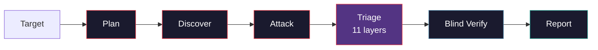

<p align="center">
 
</p>

<h1 align="center">pwnkit</h1>

<p align="center">
 <strong>Let autonomous AI agents hack you so the real ones can't.</strong><br/>
 <em>Fully autonomous agentic pentesting framework.</em>
</p>

<p align="center">
 <a href="https://www.npmjs.com/package/pwnkit-cli"></a>
 <a href="https://github.com/peaktwilight/pwnkit/blob/main/LICENSE"></a>
 <a href="https://github.com/peaktwilight/pwnkit/actions"></a>
 <a href="https://github.com/peaktwilight/pwnkit/stargazers"></a>
 
 
</p>

<p align="center">
 
</p>

<p align="center">
 <a href="https://docs.pwnkit.com">Docs</a> &middot;
 <a href="https://pwnkit.com">Website</a> &middot;
 <a href="https://pwnkit.com/blog">Blog</a> &middot;
 <a href="#benchmark">Benchmark</a> &middot;
 <a href="#the-false-positive-reduction-moat">FP Moat</a>
</p>

---

> **The leading open-source agentic AI pentest framework.** 86.5% on XBOW (90/104) — the highest score for any single-model open-source agent. Detects, verifies, and reports vulnerabilities autonomously through an 11-layer FP reduction pipeline.

Autonomous AI agents that pentest **web apps**, **AI/LLM apps**, **npm packages**, and **source code**. The agent gets a `bash` tool and works like a real pentester — writing curl commands, Python exploit scripts, and chaining vulnerabilities. Every finding walks through an 11-layer triage pipeline, then gets independently re-exploited by a blind verify agent that never sees the original reasoning.

> Beats XBOW (85%), Cyber-AutoAgent (84.6%), MAPTA (76.9%), deadend-cli (77.6%), and BoxPwnr's best single-model score (81.7%).

## Quick Start

### Docker (no install needed)

```bash
docker run --rm -e AZURE_OPENAI_API_KEY=$KEY \
  ghcr.io/peaktwilight/pwnkit:latest scan --target https://example.com
```

The image ships with Node 20, Playwright/Chromium, and the standard pentest toolbox (sqlmap, nmap, nikto, gobuster, ffuf, hydra, john, …) preinstalled.

### npx

```bash
# Pentest a web app
npx pwnkit-cli scan --target https://example.com --mode web

# White-box scan with source code access
npx pwnkit-cli scan --target https://example.com --repo ./source

# Audit an npm package
npx pwnkit-cli audit lodash

# Review source code
npx pwnkit-cli review ./my-app

# Auto-detect — just give it a target
npx pwnkit-cli https://example.com
```

See the [documentation](https://docs.pwnkit.com) for configuration, runtimes, and CI/CD setup.

## How It Works



**Shell-first agent.** The research agent gets 3 tools: `bash`, `save_finding`, `done`. It runs curl, writes Python scripts, and chains exploits the same way a human pentester does — no templates, no static rules.

**Blind PoC verification.** The verify agent receives *only* the PoC and the target path. Zero access to the research agent's reasoning or findings description. If it can't independently reproduce the exploit, the finding is killed. This eliminates confirmation bias and drives false positives toward zero.

## Features

### Detection

| Capability | Description |
|------------|-------------|
| **Shell-first agent** | `bash` + `save_finding` + `done` — the same three tools BoxPwnr uses to hit 97% |
| **White-box mode** | `--repo <path>` lets the agent read source before attacking |
| **MCP server** | `pwnkit mcp-server` exposes pwnkit as a Model Context Protocol tool |
| **npm audit** | Malicious-code and supply-chain analysis for any npm package |
| **OpenAPI import** | `--api-spec <path>` pre-loads endpoint knowledge from OpenAPI 3.x / Swagger 2.0 |
| **Authenticated scanning** | `--auth <json\|file>` supports `bearer`, `cookie`, `basic`, `header` |
| **Kali Docker executor** | Run agent commands inside a Kali container with the full toolset (`PWNKIT_FEATURE_DOCKER_EXECUTOR=1`) |
| **PTY sessions** | Long-lived interactive sessions for reverse shells, DB clients, SSH (`PWNKIT_FEATURE_PTY_SESSION=1`) |
| **Playwright browser** | Real-browser XSS oracle that cracked XBEN-011 and XBEN-018 |
| **Best-of-N racing** | `--race` runs multiple attack strategies in parallel and keeps whichever lands first |
| **EGATS tree search** | `--egats` enables Evidence-Gated Attack Tree Search (beam-search over a hypothesis tree) |

### The False-Positive Reduction Moat

pwnkit ships an 11-layer triage pipeline between the research and verify agents. Each layer is an independent filter that can kill or downgrade a finding. The overall effect matches the neural-plus-symbolic agreement Endor Labs uses to reach ~95% FP elimination — except it's open source and runs on your laptop. Full detail at [docs.pwnkit.com/triage](https://docs.pwnkit.com/triage).

| # | Layer | What it kills |
|---|-------|---------------|
| 1 | Holding-it-wrong filter | Findings whose "vuln" is the documented behavior of the sink (`fs.writeFile`, `vm.compileFunction`) |
| 2 | 45-feature extractor | Numeric feature vector per finding for downstream ML models |
| 3 | Per-class oracles | Category-specific deterministic checks (SQLi timing, XSS token, `/etc/passwd` signature, IDOR) |
| 4 | Reachability gate | Findings whose sink is not reachable from an HTTP handler or CLI entry point |
| 5 | Multi-modal agreement | Requires agreement with [foxguard](https://github.com/peaktwilight/foxguard) on the same source tree |
| 6 | PoV generation gate | No working PoC in N turns → downgrade to info (arXiv:2509.07225) |
| 7 | Structured 4-step verify | Decomposes blind verify into Reachability → Payload → Impact → Exploit |
| 8 | Self-consistency voting | Runs the structured pipeline N times and takes a majority vote |
| 9 | Adversarial debate | Prosecutor vs defender agents debate the finding, skeptical judge decides |
| 10 | Assistant memories | Semgrep-style per-target FP memories — human triage decisions injected as few-shot examples |
| 11 | EGATS tree search | Beam-search over a hypothesis tree, expanding only evidence-backed branches |

Every layer is independently toggleable via `PWNKIT_FEATURE_*` environment variables. See [docs.pwnkit.com/features](https://docs.pwnkit.com/features) for the full matrix.

### Output

| Format | Flag | Use case |
|--------|------|----------|
| Terminal | *(default)* | Human-readable report with colored severity |
| JSON | `--format json` | Programmatic consumption, CI pipelines |
| HTML | `--format html` | Rich shareable report |
| Markdown | `--format md` | GitHub issues, PR comments |
| SARIF | `--format sarif` | GitHub code scanning, Azure DevOps |
| PDF | `--format pdf` | Formal pentest reports for clients |

### Integrations

| Integration | How |
|-------------|-----|
| **GitHub Issues export** | `--export github:owner/repo` opens one issue per confirmed finding |
| **GitHub Action** | `peaktwilight/pwnkit@main` — drop-in CI/CD |
| **OpenAPI / Swagger** | `--api-spec openapi.yaml` to pre-seed endpoint knowledge |
| **Authenticated scanning** | `--auth auth.json` (bearer / cookie / basic / header) |
| **foxguard cross-validation** | `PWNKIT_FEATURE_MULTIMODAL=1` when a source tree is available |
| **MCP** | `pwnkit mcp-server` — expose pwnkit to any MCP-aware client |
| **Triage CLI** | `pwnkit triage memory add/list/remove/mark-fp` for FP memory management |

## Benchmark

Validated across 5 benchmark suites. Full breakdowns at [docs.pwnkit.com/benchmark](https://docs.pwnkit.com/benchmark).

### XBOW — 104 Docker CTF challenges

[XBOW](https://github.com/xbow-engineering/validation-benchmarks) is the standard benchmark for autonomous web pentesters: SQLi, IDOR, SSTI, RCE, SSRF, and more. Each challenge hides a `FLAG{...}` behind a real vulnerability.

| Tool | Score | Notes |
|------|-------|-------|
| [BoxPwnr](https://github.com/0ca/BoxPwnr) | 97.1% (101/104) | Best-of-N across ~10 model+solver configs; best single model 81.7% |
| [Shannon](https://github.com/KeygraphHQ/shannon) | 96.15% (100/104) | White-box, modified benchmark fork |
| [KinoSec](https://kinosec.ai) | 92.3% (96/104) | Proprietary, self-reported |
| [XBOW](https://xbow.com) | 85% (88/104) | Own agent on own benchmark |
| [Cyber-AutoAgent](https://github.com/westonbrown/Cyber-AutoAgent) | 84.62% (88/104) | Open-source, archived |
| [deadend-cli](https://github.com/xoxruns/deadend-cli) | 77.55% (76/98) | Only tested 98 challenges |
| [MAPTA](https://arxiv.org/abs/2508.20816) | 76.9% (80/104) | Patched 43 Docker images |
| **pwnkit** | **86.5% (90/104)** | **Single model, 3 tools, open-source** |

**90 unique flags / 104 challenges** with full coverage — beating MAPTA, deadend-cli, Cyber-AutoAgent, XBOW, and BoxPwnr's best single-model score, all with one model and three tools. White-box mode (`--repo`) flips previously impossible challenges by reading source before attacking.

### Other suites

| Suite | Description | Status |
|-------|-------------|--------|
| AI/LLM regression | Prompt injection, jailbreaks, system-prompt extraction, MCP SSRF | **10/10** |
| [AutoPenBench](https://github.com/lucagioacchini/auto-pen-bench) | 33 network/CVE pentesting tasks | Runner built, needs Linux Docker |
| [HarmBench](https://www.harmbench.org/) | 510 LLM safety behaviors | Harness built, needs target LLM |
| npm audit | 30 packages (malicious + CVE + safe) | Runner built |

## GitHub Action

```yaml
- uses: peaktwilight/pwnkit@main
  with:
    mode: review
    path: .
    format: sarif
  env:
    OPENROUTER_API_KEY: ${{ secrets.OPENROUTER_API_KEY }}
```

## Contributing

```bash
git clone https://github.com/peaktwilight/pwnkit.git
cd pwnkit && pnpm install && pnpm test
```

See [CONTRIBUTING.md](CONTRIBUTING.md). Created by a security researcher with [7 published CVEs](https://doruk.ch/blog).

## Part of the open-source modern SOC

pwnkit is one piece of a three-part open-source security stack — the **opensoar-hq trinity**:

| Project | Role | Stack |
|---------|------|-------|
| **[pwnkit](https://github.com/peaktwilight/pwnkit)** | Detect — AI agent pentester | TypeScript |
| **[foxguard](https://github.com/peaktwilight/foxguard)** | Prevent — security scanner | Rust |
| **[opensoar](https://github.com/opensoar-hq/opensoar-core)** | Respond — SOAR platform | Python |

When both a source tree and `foxguard` are available, pwnkit runs foxguard against the same code and requires agreement before auto-accepting findings. This is the same neural-plus-symbolic pattern Endor Labs uses for ~95% FP elimination — except open-source and running on two tools anyone can install:

```bash
export PWNKIT_FEATURE_MULTIMODAL=1
npx pwnkit-cli scan --target https://example.com --repo ./source
```

No other open-source project ships this neural-plus-symbolic agreement pattern today.

## License

[Apache 2.0](LICENSE) — built by [Peak Twilight](https://doruk.ch).
