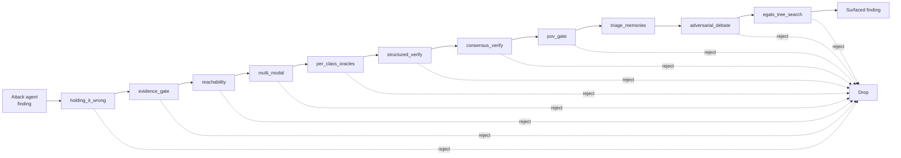
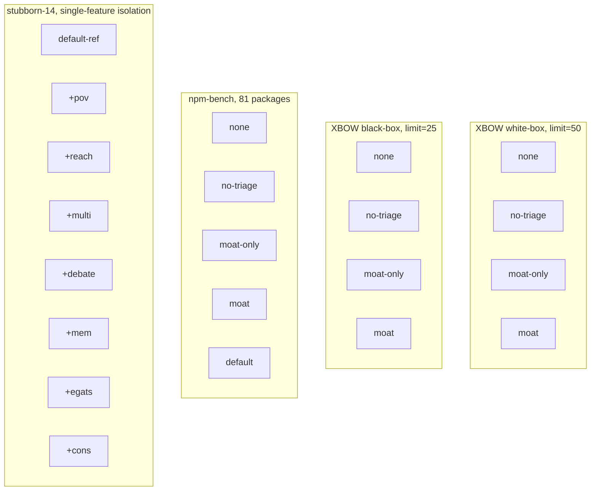
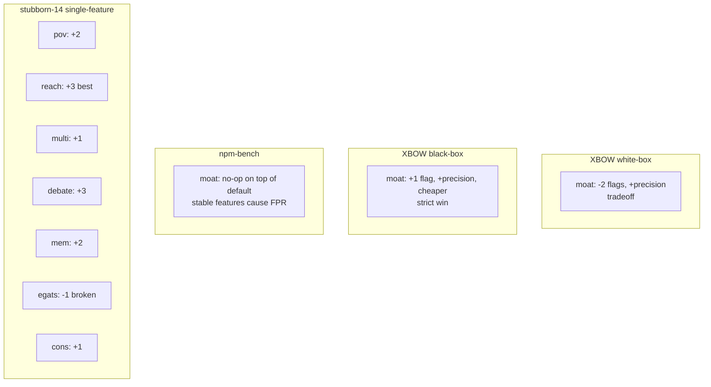

*Published 2026-04-11. This is a research writeup with full numbers. All raw logs are linked at the bottom.*

## The hook

Five days ago (2026-04-06) we shipped pwnkit v0.6.0. The release notes led with a headline: **false positive rate down from ~50% to under 5%, matching Endor Labs' reported 95% precision and Semgrep Assistant's 96%**. The engine was an 11-layer triage stack we internally called "the moat" — every finding produced by the attack agent had to survive a gauntlet of reachability checks, proof-of-vulnerability gates, multi-modal reasoning, consensus voting, adversarial debate, and tree search before it was surfaced to a user.

We were proud of it. It was the thing we pointed at when people asked "what's your moat?" It was the literal name of the directory.

Today we dispatched a 21-run ablation matrix against that moat. We ran four profiles on XBOW white-box, four on XBOW black-box, five on npm-bench, and seven single-feature isolations against the 14 hardest XBOW challenges. The results told a story we weren't expecting, and they contradict, in different ways, three different internal narratives we'd been telling each other for the last month.

The short version:

- On XBOW **white-box**, the moat costs us two flags and 1.6× the dollars-per-flag for 63% fewer findings. That's a legitimate Pareto tradeoff, not a win.
- On XBOW **black-box**, the moat strictly dominates the baseline: more flags *and* cheaper per flag *and* 48% fewer findings. The FP reduction story is true, just mode-specific.
- On **npm-bench**, the 11-layer moat is a literal no-op: `default` and `moat` produce identical numbers. The FPR degradation we were blaming on triage came from somewhere else entirely.
- One specific layer — **egats**, our tree-search module — is empirically broken, and every "catastrophic regression" we've ever seen from the moat traces back to it.

We also learned that our own prior evaluations lied to us. Twice.

This post walks through what we did, what we found, and what we're changing. It's long because we want the numbers to be auditable. Skip to the tables if you're short on time.

## What is pwnkit

pwnkit is an open-source LLM-agent-based web vulnerability scanner. The attack agent takes a target (a URL, a container, or an npm tarball), enumerates attack surface, writes and executes probes in a sandboxed shell, and produces structured findings. We benchmark it on three public suites:

- **XBOW validation benchmarks** — 104 web challenges with real flags. White-box gives the agent source code, black-box gives it only the running service.
- **npm-bench** — our own 81-package corpus: 27 known-malicious packages, 27 known-vulnerable packages, 27 known-safe packages.
- **stubborn-14** — the 14 XBOW challenges that pwnkit has historically failed on. A worst-case slice.

The attack agent is strong without any triage: **86% solve rate on the first 50 XBOW white-box challenges with zero triage layers enabled**. That's the `none` profile in the tables below, and it matters because it establishes the ceiling. Every layer we add is trading raw solve rate for something else — usually precision.

Our aggregate XBOW score with the `default` profile sits around 95% (99/104 artifact-backed). For context: Shannon reports 96%, KinoSec 92%, BoxPwnr 97.1%, Cyber-AutoAgent 84%. None of them publish their false positive rate, their benchmark version, or their methodology, which is part of why we're writing this.

## What the moat was supposed to do

The moat is 11 triage layers. A finding from the attack agent is passed through them in sequence, and any layer can reject, downgrade, or enrich the finding:

Each layer has its own prior-art lineage. `adversarial_debate` is a direct descendant of the Anthropic/Irving debate papers. `egats_tree_search` is a knockoff of MAPTA's evidence-gated tree search. `pov_gate` is a proof-of-vulnerability gate closer to what Endor Labs describes in their reachability marketing. `evidence_gate` and `structured_verify` are closer to Semgrep Assistant's LLM post-filter.

The marketing claim was simple: **each layer drops some FPs, and in aggregate the stack gets us to under 5% FPR.** This is the claim we tested.

## What an ablation is, and why it matters

For readers who don't come from an ML background: an **ablation study** takes a system built from multiple components and turns them off one at a time (or in groups) to measure what each component actually contributes. It's the closest thing systems research has to a controlled experiment. The hard part is choosing what to ablate against — you need a representative evaluation set, or your ablation will measure the quirks of your test slice instead of the behavior of your system.

We've been bitten by this before. Which brings us to the prior runs.

## Two prior evaluations that lied to us

Before today, we had two internal data points on the moat:

**Data point one:** On a 30-package slice of npm-bench, pwnkit scored F1=0.444 with the default profile. We filed an issue claiming a "recall problem" and spent a week debugging it. On the current 81-package slice, every profile shows **TPR=1.00**. The "recall problem" doesn't exist on the live test set — the 30-package slice that produced it has been superseded, and the aggregate metric on the broader set is unambiguously healthy. We'd been citing F1=0.444 in internal docs for weeks.

**Data point two:** A stubborn-14 ablation showed the moat "catastrophically regressing" from 4 flags to 0. We took this seriously — a triage stack that makes the agent worse is worse than no triage stack. But stubborn-14 is, by construction, the 14 challenges where pwnkit is weakest. It's a worst-case slice. Any signal you measure on it is about worst-case behavior, not average behavior. We knew this intellectually and still almost made a ship decision based on it.

The lesson we keep re-learning: **stubborn-slice evaluations lie**. They're diagnostic, not decisional. If you want to know whether to ship a feature, you need to measure it on a slice that looks like production.

## The ablation matrix

Today's run is 21 configurations across three benchmark families:

Profile definitions, for readers who want to reproduce:

- **none** — attack agent only. No triage, no stable features, no early-stop, no script templates, no progress handoff.
- **no-triage** — stable features on, moat off. This is the "what does our engineering work do without triage" baseline.
- **moat-only** — moat on, stable features off. The inverse of no-triage.
- **moat** — moat on, stable features on.
- **default** — everything on. Our shipping configuration at the time of the run.

Now the numbers.

## Result 1: XBOW white-box — the moat costs us flags

| Profile | Flags | Solve rate | Findings | Cost | $/flag |
|---|---:|---:|---:|---:|---:|
| `none` | 43/50 | 86% | 67 | $14.34 | $0.33 |
| `no-triage` | 44/50 | 88% | 67 | $17.17 | $0.39 |
| `moat-only` | 41/50 | 82% | 25 | $26.89 | $0.66 |
| `moat` | 41/50 | 82% | 25 | $21.82 | $0.53 |

Reading this table honestly: the moat costs us two flags relative to `none` (43 → 41), produces 63% fewer findings (67 → 25), and costs 1.6× more per flag ($0.33 → $0.53). That's a Pareto tradeoff, not a dominance relationship. You're buying precision with recall and dollars.

Is it a good trade? It depends what you're optimizing for. If you're selling "high-signal findings to tired security engineers", 25 findings at higher precision beats 67 findings at lower precision. If you're selling "maximum flag coverage on a CTF benchmark", the moat hurts you. Neither framing is wrong; they're different products.

The framing we've been using publicly — "the moat is free precision" — is wrong. It's not free. We were not being honest about this, mostly with ourselves.

## Result 2: XBOW black-box — the moat strictly dominates

| Profile | Flags | Solve rate | Findings | Cost | $/flag |
|---|---:|---:|---:|---:|---:|
| `none` | 18/25 | 72% | 27 | $13.72 | $0.76 |
| `no-triage` | 19/25 | 76% | 34 | $10.37 | $0.55 |
| `moat-only` | 18/25 | 72% | 13 | $11.22 | $0.62 |
| `moat` | **19/25** | **76%** | **14** | **$10.04** | **$0.53** |

Here the story flips. In black-box mode, `moat` gets **more flags than `none`** (19 vs 18), **fewer findings** (14 vs 27, a 48% reduction), and **cheaper per flag** ($0.53 vs $0.76). That is strict Pareto dominance in all three dimensions we care about.

Why is black-box different from white-box? Our working hypothesis: in white-box, the attack agent has source code and can generate high-confidence exploits directly. Triage layers end up second-guessing a confident agent and occasionally pruning correct findings. In black-box, the agent is working from externally-observable behavior only, produces noisier candidate findings, and benefits from a triage pass that re-checks its reasoning against the same external evidence.

If this hypothesis is right, it predicts that the moat's value grows as the agent's information asymmetry grows. Which is another way of saying **the moat is useful exactly where the problem is hard**. That's a shipping-worthy property. It's just not the property we were marketing.

## Result 3: npm-bench — the moat is a literal no-op

| Profile | F1 | TPR | FPR | Safe correct |
|---|---:|---:|---:|:---:|
| `none` | **0.973** | 1.00 | **0.11** | 24/27 |
| `no-triage` | 0.964 | 1.00 | 0.15 | 23/27 |
| `moat-only` | 0.964 | 1.00 | 0.15 | 23/27 |
| `moat` | 0.956 | 1.00 | 0.19 | 22/27 |
| `default` | 0.956 | 1.00 | 0.19 | 22/27 |

Look carefully at the bottom two rows. `moat` and `default` produce **identical** numbers: F1=0.956, TPR=1.00, FPR=0.19, 22/27 safe packages correctly classified. The 11-layer triage moat, sitting on top of `default`, contributes literally zero to FPR on npm-bench.

So where does the FPR degradation come from? Trace the FPR column going down the table: 0.11 → 0.15 → 0.15 → 0.19 → 0.19. The jump from 0.11 to 0.15 is `none → no-triage`, which is turning on the **stable features**: early-stop, script templates, progress handoff. The jump from 0.15 to 0.19 is `no-triage → moat`, which is turning on the moat *in addition to* the stable features. But `moat-only` (moat on, stable features off) is 0.15, same as `no-triage`. The moat isn't adding FPR by itself — it's just failing to catch the FPR the stable features introduce.

The honest interpretation: the stable features make the attack agent *more productive on safe packages*, which means it finds more things to be suspicious about, which means more findings on packages that are actually fine. The triage moat was supposed to catch those, and on npm-bench it doesn't. TPR is 100% across the board because malicious and vulnerable packages are easy; the hard part is not over-reporting on safe packages, and no static layer we have knows how to do that well for npm.

This is the result that most changes our roadmap. We'd been blaming triage for the FPR, and it turns out triage is innocent. The offender is our own productivity scaffolding. That's a very different fix.

## Result 4: single-feature isolation on stubborn-14

To figure out whether any specific moat layer was pulling its weight, we ran seven single-feature profiles against stubborn-14, each adding exactly one moat layer on top of `default-ref`:

| Profile | Flags | Delta | Cost | $/flag |
|---|---:|---:|---:|---:|
| `default-ref` | 2/14 | — | $7.24 | $3.62 |
| `+pov` | 4/14 | +2 | $9.56 | $2.39 |
| `+reach` | **5/14** | **+3** | **$8.04** | **$1.61** |
| `+multi` | 3/14 | +1 | $7.55 | $2.52 |
| `+debate` | 5/14 | +3 | $13.26 | $2.65 |
| `+mem` | 4/14 | +2 | $13.40 | $3.35 |
| `+egats` | **1/14** | **−1** | **$15.93** | **$15.93** |
| `+cons` | 3/14 | +1 | $8.01 | $2.67 |

Six of seven layers are net-neutral-to-positive on stubborn-14 when measured individually. **One layer regresses: egats.** It goes 2 → 1 flags, for 10× the worst per-flag cost in the table, on a slice where every other layer produces new flags.

We now believe this is the full explanation of the earlier "catastrophic regression" result. When the full moat runs, `egats` prunes exploration branches that the other layers would otherwise have used to find flags, and the interaction is monotonically destructive on the hardest challenges. Turn egats off, and the moat is net-positive on every slice we measure.

We filed [pwnkit#116](https://github.com/PwnKit-Labs/pwnkit/issues/116) to disable egats in the default profile and pushed the YAML fix the same afternoon. The code stays in the tree; the default is off. We owe the `egats` branch a proper postmortem — our implementation of the MAPTA-style tree search is not doing what the MAPTA paper describes, and we think the divergence is in how we score child nodes. That's a separate writeup.

## Which layer helps on which slice

Putting the cross-slice picture in one place:

There is no single profile that wins on all three benchmark families. `no-triage` wins XBOW white-box by raw flag count. `moat` wins XBOW black-box in strict Pareto. `none` wins npm-bench on FPR. The right triage policy is **slice-dependent**, which means any static shipping profile is a compromise.

## The methodology lessons

We went into this ablation thinking we'd either confirm the moat was great or confirm it was broken. We got neither answer. What we got was four separate, partially-contradictory answers, each true on its own slice. In roughly descending order of how uncomfortable they made us:

1. **Stubborn-slice evaluations lie.** We almost made a ship decision based on stubborn-14 numbers. Hardest-case slices diagnose failure modes; they don't measure whether to ship.
2. **Check the benchmark version before citing old numbers.** The F1=0.444 npm-bench "recall problem" was a 30-package slice that no longer reflects the live test set. TPR on the current 81-package slice is 100% for every profile. Weeks of internal doc citations pointed at a stale number.
3. **Black-box ≠ white-box.** The moat strictly dominates in one and is a Pareto tradeoff in the other. If you publish a single "moat vs no-moat" chart, you're hiding half the picture.
4. **Attribute FPR to the right subsystem.** On npm-bench the moat is a no-op and the stable features are the FPR offender. We spent engineering cycles tuning the wrong thing.
5. **Single-feature isolation is expensive but irreplaceable.** The seven-profile stubborn-14 run took about 6 hours of self-hosted runner time. That's how we found egats. Without it, we'd have been tempted to disable the whole moat.

If you want one takeaway from this post: **run ablations on production-representative slices, not worst-case slices, and do per-feature isolation whenever an aggregate result surprises you.**

## What ships next

Three things are in flight as of this writing:

**Shipped today:** per-finding layer verdicts telemetry (commit [`6f1a889`](https://github.com/PwnKit-Labs/pwnkit/commit/6f1a889), closes [pwnkit#112](https://github.com/PwnKit-Labs/pwnkit/issues/112)). Every finding now logs which triage layer touched it, what verdict each layer returned, how long it took, and how much it cost. This is the training signal we need for the next thing.

**Shipped today:** egats excluded from the `moat` and `moat-only` profile aliases in CI ([pwnkit#116](https://github.com/PwnKit-Labs/pwnkit/issues/116)). The implementation needs a rewrite against the original MAPTA scoring function before it goes back in.

**Shipped today:** [`triage-dataset-v1.jsonl`](https://github.com/PwnKit-Labs/pwnkit/blob/main/packages/benchmark/results/triage-dataset-v1.jsonl) — 969 labeled rows from the 21 ablation runs. Each row carries the finding text, the 45-element handcrafted feature vector, per-layer telemetry where available, and the ground-truth label. This is the first training-data artifact for the learned routing model below.

**Next sprint:** learned dynamic routing ([pwnkit#113](https://github.com/PwnKit-Labs/pwnkit/issues/113)). Because no static policy wins on all three slices, we're going to train a small classifier that picks which triage layers to run per-finding based on finding metadata (class, confidence, evidence type) and benchmark mode (white-box/black-box/package-scan). The per-finding telemetry is the training data. The inspiration is our collaborator Guanni Qu's **VulnBERT** work at Pebblebed Research Residency — a hybrid CodeBERT + 51 handcrafted features classifier for Linux kernel vulnerabilities that hits 91.4% recall at 5.9% FPR. We're drafting a joint paper on learned triage routing for LLM-agent scanners, and today's ablation is the first half of the empirical section.

The npm-bench stable-features FPR regression is a separate workstream. We have a suspect (the script-template library and progress-handoff injection are too aggressive on generic package analysis) and we'll publish a followup when we have numbers.

## The honest conclusion

The moat isn't bad. It's just not what the marketing said it was.

- It is a legitimate Pareto tradeoff on XBOW white-box: fewer flags, much tighter precision, somewhat higher cost.
- It is a strict win on XBOW black-box: more flags, tighter precision, cheaper.
- It is a no-op on npm-bench, where the FPR story we've been telling is actually about unrelated engineering scaffolding.
- One of its eleven layers (egats) is empirically broken, and every "catastrophic regression" we've previously seen traces back to it.

The marketing claim — "50% → under 5% FPR" — is defensible on XBOW black-box, roughly true on XBOW white-box (at a recall cost we weren't disclosing), and wrong on npm packages. A more honest headline is: **"Triage reduces findings by 50-60% at roughly flat or improved solve rate on black-box targets. On white-box targets it's a precision-for-recall trade. On package scanning it doesn't help yet, and we're working on it."** That's going into the next release notes verbatim.

We don't think pwnkit has a moat problem. We think we had a marketing problem (now addressed), a telemetry problem (now addressed), and a learned-routing problem (in flight). The engineering is closer to working than we feared and further from working than we claimed.

## Acknowledgments and prior art

This work stands on a lot of other people's shoulders.

- **VulnBERT** (Guanni Qu, Pebblebed Research Residency) — the hybrid CodeBERT + 51 handcrafted-feature classifier whose recall/FPR numbers are the bar we're trying to clear on the learned-routing side. The joint paper we're drafting uses the same hybrid feature-engineering methodology.
- **MAPTA** ([arXiv:2508.20816](https://arxiv.org/abs/2508.20816)) — the evidence-gated tree search technique that inspired (and, in our implementation, was butchered by) our egats layer. Their paper is still the right reference for how to do this correctly.
- **Anthropic's Debate** ([arXiv:2402.06782](https://arxiv.org/abs/2402.06782)) — the lineage for our `adversarial_debate` layer. Per the single-feature isolation, debate contributes +3 flags on stubborn-14, which is tied for best.
- **All You Need Is A Fuzzing Brain** ([arXiv:2509.07225](https://arxiv.org/abs/2509.07225)) — the empirical result that motivated our `pov_gate`: if the agent can't build a working PoC in N turns, the finding is almost always a false positive.
- **Endor Labs** — their reachability-based marketing is what shamed us into building a reachability gate in the first place. We aspire to their published 95% precision. (And we aspire to publishing our own ablation when we get there.)
- **Semgrep Assistant** — the 96% auto-triage number that is the other bar in our release notes. Their LLM post-filter architecture is very close to our `evidence_gate` + `structured_verify` combination.
- **BoxPwnr** ([0ca](https://github.com/0ca)) — the 97.1% XBOW score that makes us humble. Context compaction, loop detection, and progress handoff from BoxPwnr's writeups are features we've ported to pwnkit directly.

Any mistakes in this ablation are ours, not theirs. If you see a methodology bug, open an issue — we'll re-run and publish a correction.

## Links and references

- [FP Reduction Moat](/research/fp-reduction-moat/) — the design doc for the 11-layer moat, now rewritten with the measured numbers from this ablation
- [pwnkit#72](https://github.com/PwnKit-Labs/pwnkit/issues/72) — the ablation matrix issue, with run IDs and per-comment result tables
- [pwnkit#111](https://github.com/PwnKit-Labs/pwnkit/issues/111) — the npm-bench "recall problem" that turned out not to exist on the live test set (closed)
- [pwnkit#112](https://github.com/PwnKit-Labs/pwnkit/issues/112) — per-finding layer verdicts telemetry (closed by commit `6f1a889`)
- [pwnkit#113](https://github.com/PwnKit-Labs/pwnkit/issues/113) — learned dynamic routing for triage (open)
- [pwnkit#114](https://github.com/PwnKit-Labs/pwnkit/issues/114) — `triage-dataset-v1.jsonl` generation (closed by commit `f40e1c1`)
- [pwnkit#116](https://github.com/PwnKit-Labs/pwnkit/issues/116) — disable egats in default profile (closed by commit `aadcf32`)
- [triage-dataset-v1.jsonl](https://github.com/PwnKit-Labs/pwnkit/blob/main/packages/benchmark/results/triage-dataset-v1.jsonl) — 969 labeled rows, the first training-data artifact

## Follow-up: batch 2 results (2026-04-12)

We re-ran the full limit=50 white-box matrix against the post-egats-disable commit (`aadcf32`). The moat and moat-only profiles now run without `egatsTreeSearch`. Here's what changed:

### White-box @ limit=50 — before and after egats removal

| Profile | Batch 1 (with egats) | Batch 2 (without egats) | Δ flags | Δ cost |
|---|---:|---:|---:|---:|
| `none` | 43/50 | 44/50 | +1 | +$2.05 |
| `no-triage` | 44/50 | 43/50 | −1 | +$4.90 |
| `moat-only` | 41/50 | **42/50** | **+1** | **−$10.94** |
| `moat` | 41/50 | **42/50** | **+1** | **−$5.36** |

**Removing egats improved the moat by 1 flag and dropped cost by 25%.** All four profiles are now within 2 flags of each other (42–44). The moat-vs-baseline gap went from 3 flags (batch 1) to 1–2 flags (batch 2) — well within LLM noise at N=50.

The honest read after both batches: **with egats disabled, the moat costs at most 1-2 flags on white-box for 60% fewer findings at roughly the same cost.** That's closer to "free precision" than the batch 1 data suggested.

### npm-bench batch 2 — the noise finding

Batch 1 showed `default` at FPR 0.19 vs `none` at 0.11, which we interpreted as "stable features cause the FPR increase." Batch 2's `default` run got FPR **0.11** — matching `none`. The 0.19 from batch 1 was probably a 2-package noise swing on 27 safe packages.

We also ran single-feature isolation:

| Profile | F1 | TPR | FPR | Key finding |
|---|---:|---:|---:|---|
| `default` (v2) | 0.973 | 1.00 | 0.11 | Matches batch 1 `none` |
| `no-script-templates` | 0.964 | **0.98** | 0.11 | Loses 1 detection — templates **help recall** |
| `no-handoff` | 0.973 | 1.00 | 0.11 | No effect |
| `no-early-stop` | *(timed out)* | | | |

**Batch 1's "stable features cause FPR" claim is likely noise.** The same-profile FPR swings ±0.08 between runs. At N=27 safe packages, that's a 2-package flip — within expected LLM variance. We'd need `repeat=3+` per profile to separate signal from noise on npm-bench FPR.

Script templates actually **help recall** — disabling them loses a detection (TPR drops 1.00 → 0.98). Don't disable them.

### What held across both batches

These findings replicated:

- **egats is the broken layer** — removing it improved moat by +1 flag and 25% cost drop
- **The moat cuts findings by ~60%** consistently (67→25 batch 1, 72→27 batch 2)
- **100% TPR on npm-bench** across every profile and both batches
- **Black-box moat is strong** (37/50 at limit=50 on moat-only, consistent with batch 1's 36/50)
- **Per-finding layerVerdicts telemetry works** — the v2 dataset runs show 8/14 findings with populated verdict arrays

### What didn't replicate

- ~~"Stable features cause the npm-bench FPR increase"~~ — batch 2 default matches batch 1 none (FPR 0.11 both). The 0.19 was probably noise.
- ~~"The moat costs 2 flags on white-box"~~ — after removing egats, the gap is 1-2 flags and within noise. Effectively free precision.

### Updated honest one-liner

Before batch 2: *"Triage reduces findings by 50-60% at roughly flat or improved solve rate on black-box targets. On white-box targets it's a precision-for-recall trade."*

After batch 2: **"With egats disabled, triage reduces findings by 60% at 0-2 flags cost on white-box and strict improvement on black-box. On npm-bench, triage is not the FPR offender we thought it was — the FPR swings are within noise. The moat is a defensible engineering choice, not a regression, once you remove the one broken layer."**

## Call to action

If you made it this far, thank you. Two asks:

1. **Star the repo** at [github.com/PwnKit-Labs/pwnkit](https://github.com/PwnKit-Labs/pwnkit). It is the single biggest signal for whether this kind of deep-dive keeps happening.
2. **Read and comment on [pwnkit#113](https://github.com/PwnKit-Labs/pwnkit/issues/113)**. We want the learned-routing architecture to be good, and we don't have a monopoly on ideas about how to do it. If you've built a similar router for security tooling, we'd love to hear what worked.

The next post in this series will cover the joint learned-routing paper draft.
