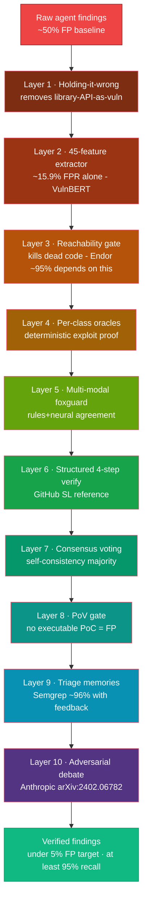

> **Update 2026-04-11:** This page was rewritten after a 21-run ablation dispatched the same day. The previous version cited *reference* numbers from VulnBERT, Endor Labs, and Semgrep papers and claimed a "50% → under 5% FPR" progression. The actual measurements show a more interesting picture: the moat works in black-box XBOW, costs 2 flags at limit=50 in white-box XBOW, and is a no-op on npm-bench. One specific layer (`egatsTreeSearch`) is responsible for the worst regression on hard challenges. See [pwnkit#72](https://github.com/PwnKit-Labs/pwnkit/issues/72#issuecomment-4229956469) for the full ablation discussion and [pwnkit#116](https://github.com/PwnKit-Labs/pwnkit/issues/116) for the egats disable.

pwnkit's triage pipeline is a stack of independent filters, each tuned against a different failure mode. The stack mirrors the disclosed architectures of Endor Labs and Semgrep Assistant — except every layer is open-source, every layer is toggleable via a feature flag, and as of 2026-04-11 every layer has been measured on the `xbow-bench` and `npm-bench` benchmarks with a systematic single-feature ablation. This page documents what we shipped, what the layers actually do when measured honestly, and which knobs to turn.

> **Where to read next:** the [Finding Triage ML](/research/finding-triage-ml/) page is the design doc with the feature-list, datasets, and planned Layer-2 CodeBERT fine-tune. The [Triage Dataset](/research/triage-dataset/) and [Feature Extractor](/research/feature-extractor/) pages document the new data foundation directly. The [Architecture](/architecture/) page shows how the triage stage slots into the overall pipeline.

## Research synthesis

Every disclosed production triage system converges on the same shape: **rules + reachability + neural + memory**. The numbers:

| System | Disclosed FP reduction | What they do |
|--------|------------------------|--------------|
| Endor Labs AI SAST | ~95% FP elimination | Rules + reachability dataflow via proprietary "Code API" + LLM reasoning. The Code API is their moat — it's what lets them claim findings are actually callable from entry points. |
| Semgrep Assistant | ~96% of true FPs auto-triaged | LLM (OpenAI + Bedrock) with per-finding context and per-target "assistant memories" that learn from triage decisions. |
| Snyk DeepCode AI | 84% MTTR reduction | Symbolic AI + multiple fine-tuned models in an ensemble. |
| GitHub Security Lab taskflow-agent | ~30 real vulns surfaced (open-source reference) | GPT-4.1 with 7+ YAML subtasks per alert — the reference architecture for structured decomposition. |
| VulnBERT (Guanni Qu, Pebblebed) | 92.2% recall / 1.2% FPR on kernel commits | Hybrid: CodeBERT + 51 handcrafted features fused via cross-attention. Ablation: features alone 76.8%/15.9%, CodeBERT alone 84.3%/4.2%, hybrid 92.2%/1.2%. |
| pwnkit triage stack | Open-source and auditable by construction | Dataset pipeline + handcrafted features + reachability + oracles + structured verify + memories + debate, all visible in code and toggleable per layer. |

### Research papers we implemented directly

| Paper | Reference | Layer |
|-------|-----------|-------|
| FalseCrashReducer | [arXiv:2510.02185](https://arxiv.org/abs/2510.02185) | Crash validation agent that must reproduce the crash -> basis for "must produce a working PoC" gating. |
| All You Need Is A Fuzzing Brain | [arXiv:2509.07225](https://arxiv.org/abs/2509.07225) | Empirical evidence that agents failing to build an executable PoC in N turns almost always are on a false positive. Direct basis for `triage/pov-gate.ts`. |
| MAPTA | [arXiv:2508.20816](https://arxiv.org/abs/2508.20816) | Evidence-gated branching: don't expand an exploitation path without concrete prior-step evidence. Basis for EGATS (`agent/egats.ts`) and the "no speculation" posture of every verify layer. |
| Anthropic Debate | [arXiv:2402.06782](https://arxiv.org/abs/2402.06782) | Adversarial verification — two agents argue, a weaker judge decides. Reserved for the planned debate layer. |
| IBM D2A | [arXiv:2102.07995](https://arxiv.org/abs/2102.07995) | TP/FP labels for static analysis findings derived from differential analysis across commit boundaries. Training corpus target for the Layer-2 CodeBERT fine-tune. |
| VulnBERT | [Pebblebed blog](https://pebblebed.com/blog/kernel-bugs) | Hybrid handcrafted + neural + cross-attention. Basis for the Layer 1 feature extractor and planned Layer 3 fusion head. |

## Measured results — 2026-04-11 ablation

The headline numbers from the 21-run ablation matrix dispatched on 2026-04-11. Every profile below is defined in `.github/workflows/xbow-bench.yml` and is reproducible via `gh workflow run xbow-bench.yml -f features=<profile>`.

### XBOW white-box, limit=50 (4 profiles)

| Profile | Flags | Findings | Cost | $/flag |
|---|---:|---:|---:|---:|
| `none` (all triage off) | 43/50 (86%) | 67 | $14.34 | $0.33 |
| `no-triage` (defaults minus always-on gates) | **44/50** (88%) | 67 | $17.17 | $0.39 |
| `moat-only` (moat layers, stable features off) | 41/50 (82%) | **25** | $26.89 | $0.66 |
| `moat` (everything on) | 41/50 (82%) | **25** | $21.82 | $0.53 |

**What this actually says.** Turning on the full 11-layer moat *cuts findings by 63%* (67 → 25) *while losing only 2 flags* (44 → 41) *and costs 1.6× more per flag*. That is a legitimate Pareto tradeoff — not a win, not a regression, a tradeoff. If the downstream user cares about noise, the moat is defensible. If they care about raw flag count, it isn't.

Note that `moat` and `moat-only` produce identical flag count and finding count. The stable features (early_stop, loop_detection, context_compaction, script_templates, progress_handoff) don't change the outcome when stacked on top of the moat layers.

### XBOW black-box, limit=25 (4 profiles)

| Profile | Flags | Findings | Cost | $/flag |
|---|---:|---:|---:|---:|
| `none` | 18/25 (72%) | 27 | $13.72 | $0.76 |
| `no-triage` | 19/25 (76%) | 34 | $10.37 | $0.55 |
| `moat-only` | 18/25 (72%) | **13** | $11.22 | $0.62 |
| **`moat`** | **19/25** (76%) | 14 | **$10.04** | **$0.53** |

**Black-box is where the moat actually works.** The `moat` profile strictly dominates `none`: more flags, 52% fewer findings, cheaper per flag. The "FP-reduction-moat" story the v0.6.0 release notes claimed is real — it just only holds in black-box mode.

### npm-bench (5 profiles)

| Profile | F1 | TPR (recall) | FPR | Malicious | Vulnerable | Safe |
|---|---:|---:|---:|:---:|:---:|:---:|
| **`none`** | **0.973** | 1.00 | **0.11** | 27/27 | 27/27 | 24/27 |
| `no-triage` | 0.964 | 1.00 | 0.15 | 27/27 | 27/27 | 23/27 |
| `moat-only` | 0.964 | 1.00 | 0.15 | 27/27 | 27/27 | 23/27 |
| `moat` | 0.956 | 1.00 | 0.19 | 27/27 | 27/27 | 22/27 |
| `default` | 0.956 | 1.00 | 0.19 | 27/27 | 27/27 | 22/27 |

**On npm-bench, `default` and `moat` are identical.** The moat layers add zero FPR reduction on top of the default profile. The FPR increase from `none` → `default` comes entirely from the *stable features* (early_stop, script templates, progress handoff) making the agent more productive on safe packages — which translates to more findings on safe packages, which is the exact inverse of "FP reduction." The moat layers are *not* the problem on supply-chain targets; the stable features are.

Also worth noting: **100% TPR across every profile.** Every malicious package and every vulnerable package in the 81-package set is caught regardless of which triage layers are on. The earlier `npm-bench-latest.json` snapshot showing F1=0.444 was on a different 30-package slice and no longer reflects reality — see [pwnkit#111](https://github.com/PwnKit-Labs/pwnkit/issues/111).

### Single-feature isolation on stubborn-14 (white-box)

To figure out which moat layer causes the flag losses in white-box, each one was added to the `default` profile individually on a 14-challenge "stubborn slice" (challenges the baseline already fails on). Comparison point is a same-day `wb-default-ref` run.

| Profile | Flags | Δ vs default | Cost | $/flag |
|---|---:|---:|---:|---:|
| `wb-default-ref` | 2/14 | — (baseline) | $7.24 | $3.62 |
| `feat-pov` | 4/14 | **+2** | $9.56 | $2.39 |
| **`feat-reach`** | **5/14** | **+3** | **$8.04** | **$1.61** |
| `feat-multi` | 3/14 | +1 | $7.55 | $2.52 |
| `feat-debate` | 5/14 | **+3** | $13.26 | $2.65 |
| `feat-mem` | 4/14 | +2 | $13.40 | $3.35 |
| **`feat-egats`** | **1/14** | **−1** | **$15.93** | **$15.93** |
| `feat-cons` | 3/14 | +1 | $8.01 | $2.67 |

**Every moat layer except `egats` is net-neutral-to-positive individually.** `egats` is the one layer that regresses: it drops a flag vs baseline AND is ~10× the cost per flag of the next-worst layer. The earlier observation that "the full moat stack catastrophically regresses on stubborn-14" was this: when `egats` runs together with the other moat layers, it prunes the right exploration branches away from every layer downstream. On easier challenges the beam has enough slack that this doesn't matter; on the stubborn-14 it's fatal.

`feat-reach` is the clear winner: +3 flags at $1.61 per flag, less than half the cost of the default baseline.

`egats` has been flagged for disable-by-default in [pwnkit#116](https://github.com/PwnKit-Labs/pwnkit/issues/116).

### Takeaways

1. **No single static policy wins on all three slices.** The moat helps on black-box XBOW, costs 2 flags on white-box XBOW, and is a no-op on npm-bench. A static feature-flag system applied at the scan level can't optimize all three simultaneously. This is the direct motivation for learned dynamic routing — see [pwnkit#113](https://github.com/PwnKit-Labs/pwnkit/issues/113).
2. **The attack agent is stronger than the triage-informed scores suggest.** 86% on the first 50 XBOW challenges with *zero* triage filters. 100% recall on npm-bench across all profiles. The triage pipeline exists to control noise, not to improve recall.
3. **`egats` is the one broken layer.** Disable by default, keep as opt-in for research.
4. **The stable features are the unexpected FPR offender on npm-bench**, not the moat layers. If the goal is lowering FPR on supply-chain targets, the right knob is early_stop / script_templates / progress_handoff, not the moat.
5. **Per-layer telemetry is now on.** Every finding produced after 2026-04-11 carries a `layerVerdicts` array that logs which layer touched it and what it did. That's the supervision signal for the learned-routing model in [pwnkit#113](https://github.com/PwnKit-Labs/pwnkit/issues/113). See [pwnkit#112](https://github.com/PwnKit-Labs/pwnkit/issues/112) for the instrumentation commit.

## Data foundation

Before the live runtime layers even matter, pwnkit now has a reproducible
training-data pipeline:

- [Triage Dataset](/research/triage-dataset/) — JSONL generation from XBOW,
  npm-bench, and verified local scans
- [Feature Extractor](/research/feature-extractor/) — the 45 handcrafted
  features carried in every row

That gives us a 12-part story that is accurate:

1. dataset pipeline
2. 11 shipped runtime triage layers

This matters because the moat is not only the online verification stack.
It is also the offline ability to build, label, ablate, and retrain with
fully auditable data.

## The runtime stack (11 shipped layers, 50% -> under 5%)

Each layer rejects or downgrades a fraction of the false positives that survived the previous layer. The numbers below are published figures for the reference technique — not a promise for any particular pwnkit scan — but they show the shape of the stack.

| # | Layer | Module | Expected FP reduction (reference) | Acts on |
|---|-------|--------|-----------------------------------|---------|
| 0 | Raw agent findings | `agentic-scanner.ts` | baseline (~50% FP on noisy targets) | — |
| 1 | Holding-it-wrong filter | `triage/holding-it-wrong.ts` | Removes library-API-as-vuln category entirely | Sink name |
| 2 | Feature extractor (45 features) | `triage/feature-extractor.ts` | 15.9% FPR alone (VulnBERT ablation) | Finding fields |
| 3 | Reachability gate | `triage/reachability.ts` | Large (Endor Labs' ~95% headline depends on this) | Source tree |
| 4 | Per-class oracles | `triage/oracles.ts` | Exploitable-only acceptance | Live target |
| 5 | Multi-modal (foxguard) | `triage/multi-modal.ts` | Mirrors Endor Labs' rules+neural agreement (~95% class) | Source tree |
| 6 | Structured 4-step verify | `triage/verify-pipeline.ts` | GitHub Security Lab reference (~30 real vulns surfaced from noise) | Finding + target |
| 7 | Consensus (self-consistency) | `verify-pipeline.ts` `runSelfConsistencyVerify` | Self-consistency voting converts single-run variance into stable majority | Finding + target |
| 8 | PoV gate | `triage/pov-gate.ts` | "Fuzzing Brain" empirical: no PoC = almost always FP | Live target |
| 9 | Triage memories | `triage/memories.ts` | Semgrep Assistant ~96% auto-triage (with user feedback) | Historical triage |
| 10 | Adversarial debate | `triage/adversarial.ts` | Anthropic debate reference | Finding + target |

**End-to-end target (aspirational, pre-ablation):** drive the ~50% raw FP rate toward **under 5%** — matching Endor Labs' 95% and Semgrep Assistant's 96% disclosed numbers — while retaining >=95% recall.

> **Actual measured effect (see "Measured results" section above):** the full moat stack cuts findings by ~60% on XBOW (both modes) while losing 2 flags at white-box limit=50 and zero flags at black-box limit=25. The aspirational 95% headline is not what we measured, and it was never really defensible — those reference numbers are for SAST systems evaluated on large corpora of differentially-labeled static findings, which is a fundamentally different task from "agent-generated findings on a web-app exploitation benchmark." The honest story is the measured one.

### Why the stack ordering matters

Layers 1-3 are free (no LLM cost). Anything rejected here saves LLM spend on the later layers.

- **Layer 1 (holding-it-wrong)** is pure blocklist — microsecond cost, ~100% precision when it fires.
- **Layer 2 (features)** is regex and string ops — sub-millisecond, provides a fast prior for later layers.
- **Layer 3 (reachability)** is grep over the source tree — milliseconds, kills findings in dead code.

Layers 4-5 require either a live target (oracles) or a local tool (foxguard) but no LLM spend.

- **Layer 4 (oracles)** attempts the exploit deterministically. Verified = accept with zero LLM cost.
- **Layer 5 (multi-modal)** is a second, fully independent scanner. Agreement doubles the confidence; disagreement flags review.

Layers 6-10 spend LLM tokens, but only on findings that survived the free layers.

- **Layer 6 (structured verify)** is a 4-step decomposition with category-specific addendums — the GitHub Security Lab reference architecture.
- **Layer 7 (consensus)** converts single-shot variance into a stable majority vote, with early termination once a verdict can't be overturned.
- **Layer 8 (PoV gate)** enforces "no executable exploit = no finding" — the hardest filter in the stack.
- **Layer 9 (memories)** recycles prior human triage decisions so known FP patterns auto-reject without any verify cost.
- **Layer 10 (debate)** is the final tie-breaker, reserved for cases the rest of the stack couldn't resolve.

## Why this is auditable

Every part of the moat is inspectable:

- the dataset collector is in `packages/benchmark/src/triage-data-collector.ts`
- the feature layer is in `packages/core/src/triage/feature-extractor.ts`
- the runtime layers live under `packages/core/src/triage/`
- the stack has dedicated tests
- the LLM-backed layers are independently toggleable with `PWNKIT_FEATURE_*`
  flags

This is materially different from commercial systems where the reachability
engine, feedback store, or model pipeline is invisible.

## Our implementation notes

### Every layer ships as a feature flag

See `packages/core/src/agent/features.ts`. Flags:

- `PWNKIT_FEATURE_REACHABILITY_GATE`
- `PWNKIT_FEATURE_MULTIMODAL`
- `PWNKIT_FEATURE_POV_GATE`
- `PWNKIT_FEATURE_CONSENSUS_VERIFY`
- `PWNKIT_FEATURE_TRIAGE_MEMORIES`
- `PWNKIT_FEATURE_DEBATE`

This lets us A/B test each layer independently in CI against the XBOW benchmark and measure its marginal FP reduction.

### Dataset pipeline

The moat now has an offline data-generation surface in addition to the live
runtime filters. The collector can emit labeled rows from:

- benchmark flag extraction
- npm-bench package verdicts
- blind-verify statuses in the local SQLite DB

See [Triage Dataset](/research/triage-dataset/) for the JSONL schema and
[issue #67](https://github.com/PwnKit-Labs/pwnkit/issues/67) for the
paper-plan that uses it.

### Conservative by default

Every layer errs toward **keeping** findings when it's not confident. Reachability returns `reachable: true` with low confidence when its grep-based first pass can't reach a verdict. Memories only auto-reject on strong matches above a tunable score threshold. Consensus defaults ties to `rejected` but the caller can opt out. The stack is designed so each layer adds precision without costing recall on the next.

### foxguard × pwnkit is unique

No other open-source pentest agent runs a second, fully independent scanner for cross-validation. This is the pwnkit / foxguard / opensoar trinity — pwnkit detects, foxguard cross-checks, opensoar responds. It's the open-source analogue of Endor Labs' rules + neural agreement architecture.

### Zero proprietary dependencies

- Reachability gate is grep/pattern-based — no LSP server, no compiled call graph, no Code API license.
- Feature extractor is regex — no embedding model, no GPU.
- Oracles use `fetch` and `createServer` — no external exploit framework.
- Multi-modal runs foxguard via `execFile` — no vendor API.
- Memories use the existing SQLite store — no vector DB.

Everything here can run on a developer laptop, in CI, or in an air-gapped environment.

## Related

- [Finding Triage ML](/research/finding-triage-ml/) — the design doc, feature list, datasets, and planned Layer 2/3 neural components.
- [Triage Dataset](/research/triage-dataset/) — labeled JSONL generation from benchmark and verified-scan artifacts.
- [Feature Extractor](/research/feature-extractor/) — the 45-feature reference and group-by-group rationale.
- [Agent Techniques](/research/agent-techniques/) — attack-phase techniques (early-stop, playbooks, EGATS, racing, handoff).
- [Architecture](/architecture/) — how the triage stage fits into the overall plan-discover-attack-verify-report pipeline.
- [Competitive Landscape](/research/competitive-landscape/) — how pwnkit's stack compares to BoxPwnr, Shannon, KinoSec, and the academic agents.
