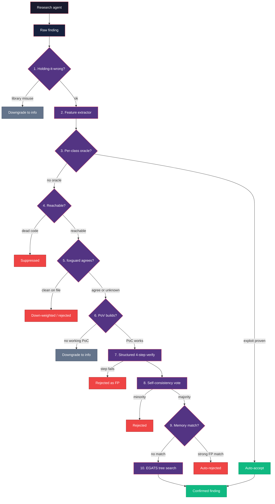

Autonomous pentesters are only as valuable as their false-positive rate.
pwnkit ships a full triage pipeline between the research agent and the
blind verify agent. Every finding walks through a stack of independent
filters, each of which can kill, downgrade, or boost it. Most filters are
deterministic, zero-cost, and run before any LLM verification token is
spent.

The overall effect is the same neural-plus-symbolic agreement strategy
Endor Labs uses to reach ~95% FP elimination — except it's open source and
runs on your laptop.

## Pipeline overview



Each stage is independently configurable via environment variables and
surfaced through `packages/core/src/triage/`.

## 1. Holding-it-wrong filter

**Module:** `triage/holding-it-wrong.ts` (always on)

Kills findings where the "vulnerability" is literally the documented
behavior of the sink. Classic examples: reporting `fs.writeFile` as an
arbitrary-file-write vuln, `vm.compileFunction` as code execution, or
`toFunction(cb)` as callback injection. The filter downgrades the
finding to `info` and skips downstream verification.

## 2. 45-feature extractor

**Module:** `triage/feature-extractor.ts` (always available)

Extracts a 45-element numeric vector per finding: response shape
(status, size, reflection, error markers), payload signals (encoding,
sink class, parameter location), and category priors. Inspired by
VulnBERT's hybrid architecture — handcrafted features alone achieve
~77% recall / 16% FPR, and the same vector fuses cleanly with neural
embeddings for downstream ML.

See `FEATURE_NAMES` in the module for the full ordered feature list.

## 3. Per-class oracles

**Module:** `triage/oracles.ts` (always on for supported categories)

Deterministic, category-specific verification oracles. No exploit, no
report.

| Category | Oracle | Proof |
|----------|--------|-------|
| SQLi | `verifySqli` | SQL error signatures + timing delta under sleep payloads |
| Reflected XSS | `verifyReflectedXss` | Unique token reflected in an executable context |
| SSRF | `verifySsrf` | Out-of-band callback (spins a local listener on demand) |
| RCE | `verifyRce` | Command output round-trip through the response |
| Path traversal | `verifyPathTraversal` | `/etc/passwd` signature (or Windows equivalent) |
| IDOR | `verifyIdor` | Differential response across identities |

Call `verifyOracleByCategory(finding, target)` to dispatch by category.

## 4. Reachability gate

**Module:** `triage/reachability.ts`
**Flag:** `PWNKIT_FEATURE_REACHABILITY_GATE=1`

When a source tree is available, walks imports, route mounts, and
framework entry points to check whether the vulnerable sink is
actually reachable from an HTTP handler, CLI main, or user-facing API.
Dead code and test-only paths are suppressed before we spend LLM
tokens verifying them.

This is a zero-dependency grep/pattern pass today and is deliberately
conservative: when it cannot make a confident call it returns
`reachable: true` with low confidence so later stages still get a
chance. A tree-sitter-based interprocedural upgrade is planned.

## 5. Multi-modal agreement (foxguard × pwnkit)

**Module:** `triage/multi-modal.ts`
**Flag:** `PWNKIT_FEATURE_MULTIMODAL=1`

When both a source tree and the [foxguard](https://github.com/peaktwilight/foxguard)
binary are available, pwnkit runs foxguard against the same code and
cross-checks every finding against foxguard's SARIF output.

- **Both scanners fire on the same file / category** → auto-accepted
  with high confidence.
- **Only pwnkit fires, foxguard scanned the file cleanly** →
  down-weighted or auto-rejected.
- **foxguard didn't scan the file** → no signal either way.

```bash
export PWNKIT_FEATURE_MULTIMODAL=1
npx pwnkit-cli scan --target https://example.com --repo ./source
```

This is the opensoar-hq trinity validation pattern: pwnkit detects,
foxguard cross-checks, opensoar responds.

## 6. PoV generation gate

**Module:** `triage/pov-gate.ts`
**Flag:** `PWNKIT_FEATURE_POV_GATE=1`

Backed by the empirical ground truth from *All You Need Is A Fuzzing
Brain* (arXiv:2509.07225): if an agent can't build a working PoC in N
turns, the finding is almost certainly a false positive.

Spins up a narrowly-scoped mini agent loop whose only job is to
produce a concrete, executable exploit that demonstrably works. No
speculation, no "would-be" payloads — the exploit must run and the
response must contain category-specific proof of exploitation.

- `hasPov: true` → boost confidence, attach the artifact to
  `finding.evidence`.
- `hasPov: false` → downgrade severity to `info` and set
  `triageNote = "no_pov"`.

## 7. Structured 4-step verify pipeline

**Module:** `triage/verify-pipeline.ts` (default when a runtime is available)

Inspired by GitHub Security Lab's taskflow-agent approach, the single-shot
blind verify is decomposed into four focused subtasks, each with domain-
specific prompts and category-specific addendums:

1. **Reachability analysis** — can the vuln be triggered from external
   input?
2. **Payload validation** — does the PoC actually demonstrate the claim?
3. **Impact assessment** — what is the real-world security impact?
4. **Exploit confirmation** — independently reproduce with only the PoC
   and the target path.

Any step failure marks the finding as a false positive.

## 8. Self-consistency voting

**Flag:** `PWNKIT_FEATURE_CONSENSUS_VERIFY=1`

Runs the structured verify pipeline N times (different sampling seeds)
and takes the majority vote. Trades tokens for confidence — useful on
ambiguous findings where a single verify pass is noisy.

## 9. Assistant memories

**Module:** `triage/memories.ts`
**CLI:** `pwnkit triage ...`
**Flag:** `PWNKIT_FEATURE_TRIAGE_MEMORIES=1`

Semgrep-style per-target persistent FP context that learns from human
triage decisions. When a user marks a finding as a false positive (and
says why), the reason is stored as a `TriageMemory`. On future scans
the memories are injected as few-shot examples into the verify prompt,
and a sufficiently strong match auto-rejects the finding without
spending a verify call.

Scope hierarchy:

- `global` — applies to every scan.
- `package` — applies to findings whose target starts with a given
  package identifier (npm name, repo prefix).
- `target` — applies only to an exact target URL or path.

Relevance is currently a lightweight token-overlap heuristic; an
embedding-backed ranker can replace `scoreMemory` without touching the
public API.

### `pwnkit triage` commands

```bash
# Mark a finding as a false positive and remember why
pwnkit triage mark-fp <finding-id> --reason "test fixture, not prod"

# Add a standalone memory (without a backing finding)
pwnkit triage memory add --finding <id> --reason "sink is harmless helper" \
  --scope package --scope-value my-pkg

# List memories
pwnkit triage memory list --scope target
```

## 10. EGATS — Evidence-Gated Attack Tree Search

**Flag:** `--egats` or `PWNKIT_FEATURE_EGATS=1`

Beam-search over an explicit hypothesis tree. The agent proposes attack
branches, each with required evidence, and only expands branches where
prior evidence is observed. Dead hypotheses are pruned aggressively,
which keeps the budget focused on exploitable paths.

EGATS is the highest-variance stage in the pipeline — use it when you
need breadth (e.g. unknown-class vulnerabilities) rather than depth on
a known lead.

## Configuration cheat-sheet

| Env var | Default | Stage |
|---------|---------|-------|
| `PWNKIT_FEATURE_REACHABILITY_GATE` | off | 4 |
| `PWNKIT_FEATURE_MULTIMODAL` | off | 5 |
| `PWNKIT_FEATURE_POV_GATE` | off | 6 |
| `PWNKIT_FEATURE_CONSENSUS_VERIFY` | off | 8 |
| `PWNKIT_FEATURE_TRIAGE_MEMORIES` | off | 9 |
| `PWNKIT_FEATURE_EGATS` | off | 10 |
| `PWNKIT_FEATURE_DEBATE` | off | Adversarial prosecutor/defender debate |

See [Features](/features/) for the complete env-var inventory.

## Further reading

- [Agent Loop](/agent-loop/) — how the research agent drives `bash`
- [Blind Verification](/blind-verification/) — how step 7 isolates the
  verify agent from the research agent's reasoning
- [Research: Finding Triage ML](/research/finding-triage-ml/) — the
  longer-form synthesis behind this pipeline
